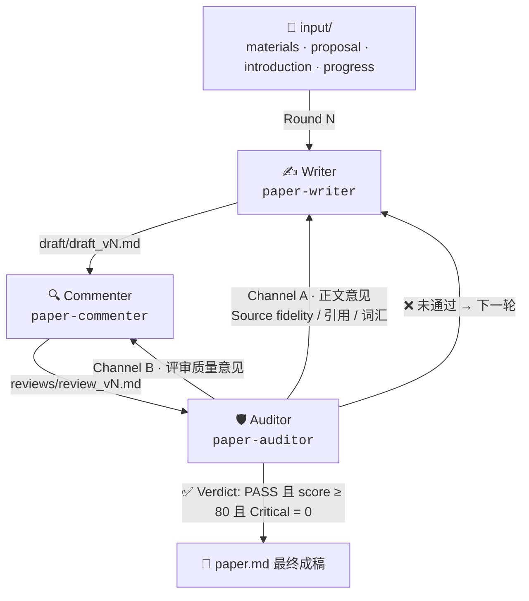

<div align="center">

# 📄 论文 Harness · paper-harness

**Writer → Commenter → Auditor：为学术写作打造的三角色 Agent 循环**

Forked from [deepseek-harness](https://github.com/deepseek-ai/deepseek-harness) — 保留单体 Agent 的全部 DeepSeek 原生能力，把 Agent loop 重组为论文写作专用流水线。

   

---

</div>

## 什么是论文 Harness？ / What is it?

三个角色循环接力、自动收敛，直到一份**审计通过的论文**落盘：

| 角色 | Preset | 职责 | 产出 |
|---|---|---|---|
| ✍️ **Writer** | `paper-writer` | 通读 `input/` 材料与全部历史反馈，撰写/改写论文正文 | `draft/draft_vN.md` |
| 🔍 **Commenter** | `paper-commenter` | 六维 rubric（0–100）逐项打分 + 分级问题清单 | `reviews/review_vN.md` |
| 🛡️ **Auditor** | `paper-auditor` | **直接阅读原始文献**逐一核验每条 claim↔cite，并审计评论质量 | `audits/audit_vN.md` |

三个 Agent **全部保留 DeepSeek 原生 skill 能力**（fs-sandbox、web、web-fetch-http、web-search-deepseek、shell-env、skill-filesystem、tool-skill），差异只来自各自的角色预设与提示词——能力不缩水，分工更专注。

---

## 三角色循环 / The Three-Role Loop



- **Auditor 是收敛裁判**：它把审计意见**同时**投喂给 Writer 与 Commenter 两条通道（Channel A / Channel B），下一轮二者都据此改进。
- 每轮三份产物（`draft` / `review` / `audit`）全部落盘，**可追溯、可回放、可审计**。
- 达成交付标准即收敛，最多运行 `--rounds` 轮（默认 5）。

### Auditor 的双通道审计

```
Channel A → Writer        Channel B → Commenter
├─ 逐条提取 claim↔cite     ├─ 评论是否漏判 Critical 问题？
├─ 直接读取原始文献分类:     ├─ 六个维度是否误判 / 过评 / 漏评？
│   ALIGNED / PARTIAL /    └─ 记录每条具体分歧
│   DRIFT / UNCHECKED
├─ 引用格式一致性、孤儿引用
└─ 词汇一致性（无 drift）
```

### Commenter 的六维 rubric

`Argument flow · Claim sharpness · Evidence-claim alignment · Academic voice · Reader clarity · Abstract alignment` — 每维 0–100，附 1–3 句依据，问题分 Critical / High / Medium 三档。

### 收敛判定 / Convergence

解析审计产物中的机器可读 `## Verdict` 段：

```
- Result: PASS or FAIL
- Score: <0-100>
- Critical count: <N>
```

**通过 ⇔ `Result: PASS` 且 `Score ≥ pass_score` 且 `Critical count = 0`**。任一不满足，Writer 与 Commenter 各自拿到审计意见进入下一轮。

---

## 快速开始 / Quick Start

### 🪟 Windows（免安装 EXE）

从 [Releases](https://github.com/usher233/paper-harness/releases) 下载 `paper-harness-win-x64.zip`，解压后双击或在终端运行：

```bat
paper-harness.exe --profile paper demo
```

> 内置 Node 运行时与完整插件闭包，零依赖、免配置。系统需有 `DEEPSEEK_API_KEY` 环境变量（或 API 网关可达）。

### 🐧 源码运行 / From source

要求 **Node `^22.19 || >=24`** 与 **pnpm**：

```bash
git clone https://github.com/usher233/paper-harness.git
cd paper-harness
pnpm install
pnpm run build

# 创建论文主题工作区（自动生成 input/ 模板）
export DEEPSEEK_API_KEY=sk-xxxx

# 运行三角色循环，直到审计通过
pnpm dsh --profile paper demo
```

### 使用示例 / Usage

```bash
# 完整循环：最多 5 轮，审计分数 ≥ 80 即收敛
dsh --profile paper demo

# 收紧标准：最多 3 轮，分数 ≥ 90
dsh --profile paper demo --rounds 3 --score 90

# 指定工作区（默认 <cwd>/papers）
dsh --profile paper demo --workspace /data/papers
```

`--workspace` 不存在时自动脚手架：生成 `input/proposal.md`、`input/introduction.md`、`input/progress.md` 与 `input/materials/` 空目录，把材料丢进 `materials/` 即可开跑。

---

## 工作区结构 / Workspace Layout

```
papers/
└── <topic>/
    ├── input/                    # 输入材料（写入者消费）
    │   ├── proposal.md           #   论文主张 · 范围 · 目标 venue
    │   ├── introduction.md       #   背景与 gap
    │   ├── progress.md           #   已完成 / 待办
    │   └── materials/            #   参考文献全文 / 数据 / 笔记
    ├── draft/draft_vN.md         # 每轮 Writer 产出
    ├── reviews/review_vN.md      # 每轮 Commenter 评审（六维打分）
    ├── audits/audit_vN.md        # 每轮 Auditor 审计（含 Verdict）
    └── paper.md                  # ✅ 收敛后的最终论文
```

每一轮都是**完整可回放的一次快照**：`draft_vN` + `review_vN` + `audit_vN` 三方齐备，审计意见逐条指向章节。

---

## 保留的 DeepSeek 原生能力 / Native DeepSeek Skills

每个角色 Agent 都保留完整的 DeepSeek 原生工具层，再叠加角色预设：

| 能力层 | 内容 |
|---|---|
| 文件系统 | `fs-sandbox` · `skill-filesystem` |
| 网络 | `web` · `web-fetch-http` · `web-search-deepseek` |
| 执行 | `shell-env` · bash / pwsh |
| 技能 | `tool-skill`（加载角色专属 skill） |
| 角色定制 | `paper-writer` / `paper-commenter` / `paper-auditor` 预设 |

写作、评审、审计**三个 Agent 都能独立读写文件、搜索并直接抓取原始文献**——引用锚定在真实源头，而非模型记忆。

---

## 与上游的关系 / Relationship to Upstream

[deepseek-harness](https://github.com/deepseek-ai/deepseek-harness) 的全插件 Cordis 架构、工具层、模型接入（DeepSeek 原生）全部保留。本 fork 的改动：

1. **新增** `@deepseek-ai/dsh-paper` bundle：三角色循环驱动、工作区模型、角色提示词与收敛判定。
2. **新增** `paper-writer` / `paper-commenter` / `paper-auditor` 三个角色预设。
3. **新增** EXE 打包脚本与 GitHub Actions Release 工作流（Windows / Linux / macOS 单文件发布）。
4. 运行入口：`dsh --profile paper <topic>`。

---

## 致谢 · GitHub 来源 / Credits

| 来源 | 许可 | 集成方式 |
|---|---|---|
| [shimo4228/claude-skill-paper-ecosystem](https://github.com/shimo4228/claude-skill-paper-ecosystem) | MIT | Writer 的 Source Fidelity 规则、词汇一致性、学术 voice；Auditor 逐条核验 claim↔cite 的方法，适配为 dsh 角色预设 |
| [Leooo-Huang/academic-research-skills](https://github.com/Leooo-Huang/academic-research-skills) | CC BY-NC | 仅借鉴 0–100 rubric 与 integrity gate **概念**，自研实现（未复制代码） |
| [blazickjp/arxiv-mcp-server](https://github.com/blazickjp/arxiv-mcp-server) | MIT | 可选用作文献检索工具；未启用时 Writer 用 WebSearch / WebFetch 兜底 |
| [PaperJury](https://github.com/Academic-Synthesis-Lab/PaperJury) / [CycleResearcher](https://github.com/Academic-Synthesis-Lab/CycleResearcher) | — | 借鉴 review→revise→复查 与问题跟踪模式，落地为工作区产物 + 收敛判定 |

上游 [deepseek-harness](https://github.com/deepseek-ai/deepseek-harness) — MIT。

---

## License

MIT © usher233

```
MIT License

Permission is hereby granted, free of charge, to any person obtaining a copy
of this software and associated documentation files (the "Software"), to deal
in the Software without restriction, including without limitation the rights
to use, copy, modify, merge, publish, distribute, sublicense, and/or sell
copies of the Software, and to permit persons to whom the Software is
furnished to do so, subject to the following conditions:

The above copyright notice and this permission notice shall be included in all
copies or substantial portions of the Software.

THE SOFTWARE IS PROVIDED "AS IS", WITHOUT WARRANTY OF ANY KIND, EXPRESS OR
IMPLIED, INCLUDING BUT NOT LIMITED TO THE WARRANTIES OF MERCHANTABILITY,
FITNESS FOR A PARTICULAR PURPOSE AND NONINFRINGEMENT.
```
